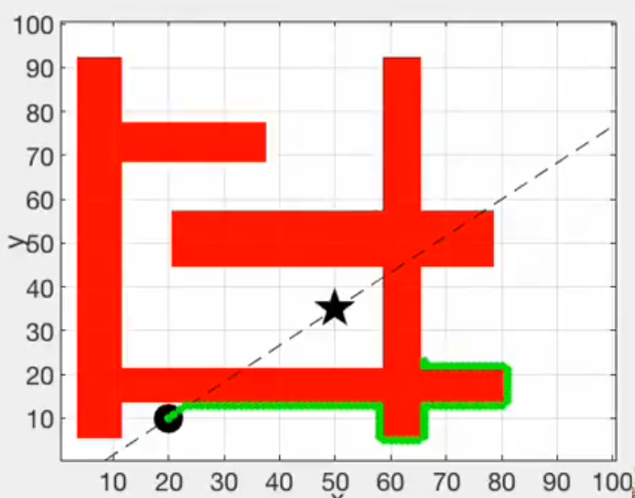

# Path-finder-in-matlab

path finder in matlab using peter corke robotics toolbox tutorial

first install peter corke robotics toolbox tutorial in matlab:
 https://www.youtube.com/watch?v=VyWMFxmMDXg

Before ruuning the code make sure that you add toolbox to path 
                            or run
   >>startup_rvc.m

otherwise code will show some error

link to understand peter corke robotics toolbox video lecture:https://robotacademy.net.au/

contact: 
email id: vermahrithik10@gmail.com 

direct message me at instagram:https://www.instagram.com/hrithik.verma.100/?hl=en
